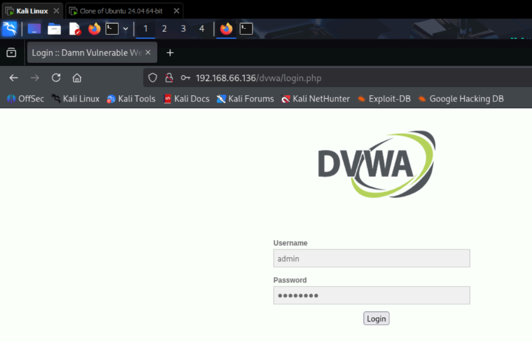
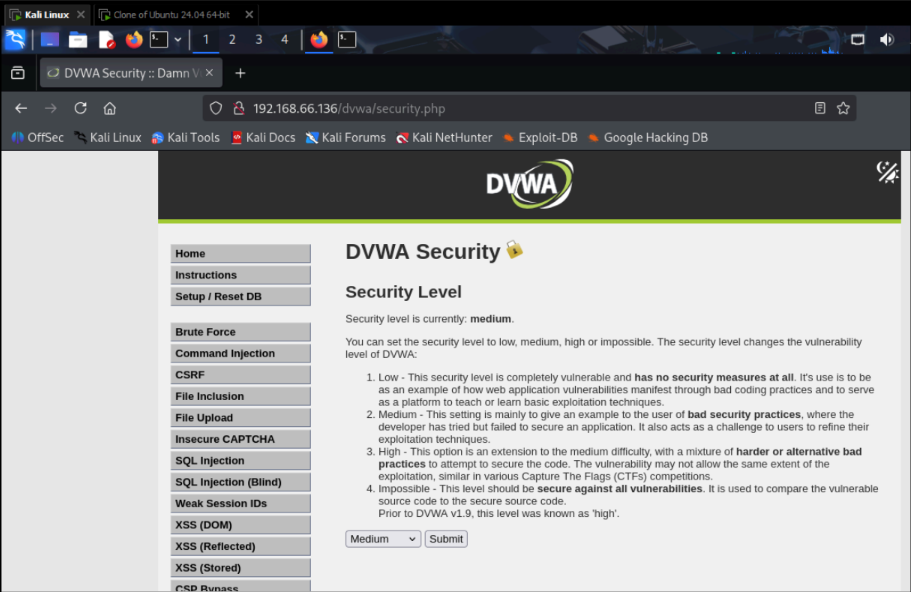
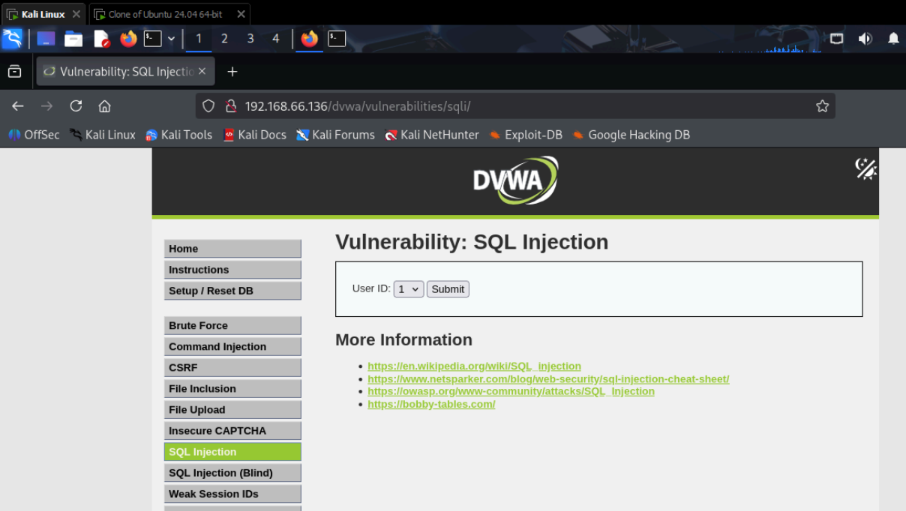
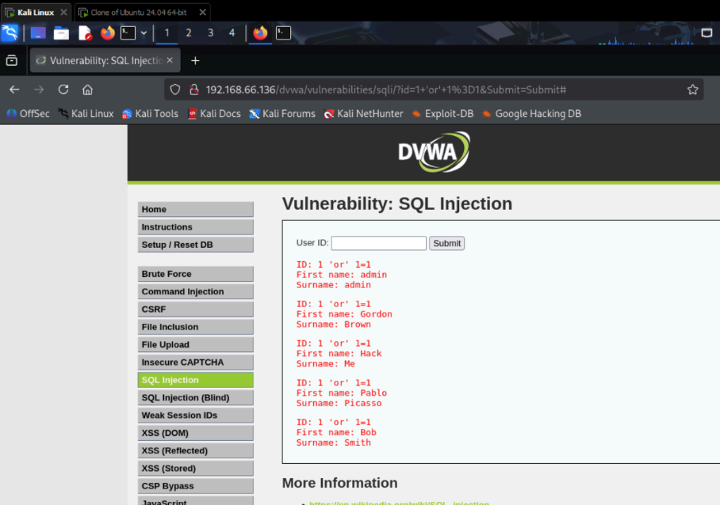

# Análisis de Vulnerabilidad SQL Injection en DVWA

## 📋 Descripción del Proyecto

Análisis práctico de una vulnerabilidad de **Inyección SQL** en la aplicación web vulnerable deliberadamente **Damn Vulnerable Web Application (DVWA)**, realizado como parte de la evaluación académica. Este proyecto sigue los requerimientos específicos de la prueba.

## 🖥️ Entorno de Pruebas

Este proyecto se realizó utilizando un entorno de virtualización con **VMWare** que consta de dos máquinas virtuales:
- **Servidor Web:** Ubuntu Server 24.04 con DVWA instalado
- **Máquina de Ataque:** Kali Linux 2025.2 para realizar las pruebas

## 🎯 Objetivos de la Evaluación

### ✅ 1. Iniciar sesión en DVWA utilizando un navegador web
Acceso exitoso a la aplicación DVWA mediante credenciales válidas desde el navegador web en Kali Linux.

### ✅ 2. Seleccionar el nivel de seguridad medio
Configuración del nivel de seguridad en "Medium" según lo establecido en los requerimientos de clase.

### ✅ 3. Definir el área vulnerable
Identificación de la sección SQL Injection dentro del menú de vulnerabilidades de DVWA.

### ✅ 4. Seleccionar UserId como el campo vulnerable
Reconocimiento del campo "User ID" como el punto de inyección vulnerable.

### ✅ 5. Introducir consulta SQL maliciosa
Ejecución de consultas SQL diseñadas para extraer información de la base de datos.

## 🔄 Proceso de Ejecución

### Paso 1: Inicio de sesión en DVWA
- Acceso a la aplicación mediante la URL `http://[IP-UBUNTU]/dvwa/`
- Autenticación con usuario: `admin` / contraseña: `password`

### Paso 2: Configuración de seguridad
- Navegación a la sección "DVWA Security"
- Selección del nivel "Medium" en el dropdown de seguridad

### Paso 3 y 4: Identificación y selección del área vulnerable
- Navegación a la sección "SQL Injection" en el menú de vulnerabilidades e identificación del campo "User ID" como vector de ataque

### Paso 5: Inyección de consulta SQL maliciosa
- **Consulta:** `1 'or' 1=1` para extraer información

## 📸 Evidencia del Cumplimiento

| Requerimiento | Evidencia Visual | Descripción |
|---------------|------------------|-------------|
| **1. Login exitoso** |  | Sesión iniciada como admin en DVWA |
| **2. Nivel medio** |  | Configuración de seguridad en nivel Medium |
| **3-4. Área y campo vulnerable** |  | Sección SQL Injection identificada y selección de campo "User ID como vulnerable|
| **5. Consulta maliciosa** |  | Resultados de la inyección mostrando información |

## 📊 Resultados Obtenidos

✅ **Todos los requerimientos cumplidos exitosamente**  
✅ **Consulta SQL ejecutada:** `1 'or' 1=1`  
✅ **Vulnerabilidad explotada:** Bypass de autenticación básico  
✅ **Información obtenida:** Todos los registros accesibles mediante la consulta inyectada

## 🔍 Análisis de la Consulta

La consulta `1 'or' 1=1` funciona porque:

1. **`1`** - Proporciona un ID de usuario válido
2. **`'or'`** - Añade el operador OR
3. **`1=1`** - Siempre evalúa como TRUE, haciendo que toda la condición sea verdadera

## 🛠️ Tecnologías Utilizadas

- **Virtualización:** VMWare Workstation 17 PRO
- **Sistemas Operativos:** Ubuntu Server 24.04, Kali Linux 2025.2
- **Herramientas:** Navegador web, DVWA, MySQL

## 📚 Conclusión

Este proyecto demuestra la comprensión práctica de:
- Configuración de entornos de testing seguros
- Identificación de vulnerabilidades SQL Injection
- Explotación básica usando consultas simples
- Documentación técnica de procesos de seguridad

